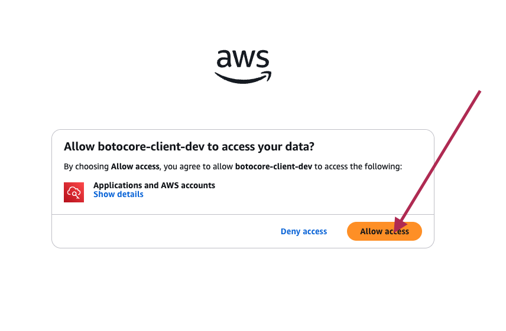
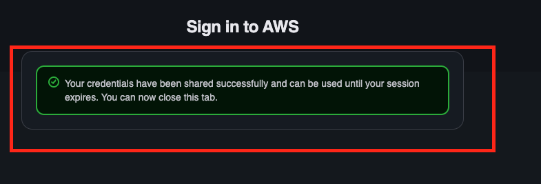

# 📘 SSO-SSM User Manual

## 🚀 1. Clone the Repository

Open your terminal:

* **Windows** → PowerShell
* **Mac/Linux** → zsh / bash

Run:

```bash
git clone https://github.com/ugl-dev1100/ssm-sso-configuration.git
```

---

## 📂 2. Navigate to Project Folder

```bash
cd ssm-sso-configuration
```

### 👉 For Windows Users

* Go to `windows/` folder
* Run:

```powershell
install.ps1
```

* Follow interactive prompts (keep pressing **Next**)

### 👉 For Mac/Linux Users

* Go to `mac-linux/` folder
* Run:

```bash
bash install.sh
```

---

## 🔐 3. Configure AWS SSO

Run:

```bash
aws configure sso
```

### Enter the following details:

* **SSO session name**: `uat`
* **SSO start URL**:

  ```
  https://d-9f676488e3.awsapps.com/start/
  ```
* **SSO region**: `ap-south-1`
* **SSO registration scopes**: Press **Enter**

---

## 🌐 4. Browser Authentication

* A browser window will open
* Click **Allow Access**

📸 Reference:


---

## ✅ 5. Authentication Response

After login, you will see confirmation:

📸 Reference:


---

## 🏢 6. Select AWS Account

You will see two accounts:

### 🔹 Production Account

```
Raghavendra Sinha, raghu@audintel.com (471201224424)
```

### 🔹 UAT Account

```
Audintel@UAT, raghu@audintel.in (670307493739)
```

👉 Select based on your use case:

* **UAT setup → choose UAT account**
* **Prod setup → choose Production account**

---

## 🔑 7. Select Permission Set

You may see options like:

```
uat-bastion-ssh-access
ViewOnlyAccess
uat-DBA-permissions
Billing
```

👉 Choose the permission set based on your access needs:

---

## ⚙️ 8. Final Configuration Inputs

* **Default client region**: `us-east-1`
* **CLI output format**: `json`
* **Profile name**: `uat`

---

## 🧪 9. Verify Configuration

```bash
aws sts get-caller-identity --profile uat
```

---

## 🔁 10. Repeat for Production

Repeat the same steps with these changes:

* Select **Production account**:

  ```
  Raghavendra Sinha, raghu@audintel.com (471201224424)
  ```
* Use:

  * **SSO session name**: `prod`
  * **Profile name**: `prod`

---

## 🧪 11. Verify the Configuration

### 🔹 Check Production Profile

```bash
aws sts get-caller-identity --profile prod
```

**Expected Output:**

```json
{
    "UserId": "AROAW3NOIC3UKPHXZRX54:sivaramakrishna.konka@audintel.in",
    "Account": "471201224424",
    "Arn": "arn:aws:sts::471201224424:assumed-role/AWSReservedSSO_CustomDevOpsPermissions_c8e8bb7ee530af45/sivaramakrishna.konka@audintel.in"
}
```

---

### 🔹 Check UAT Profile

```bash
aws sts get-caller-identity --profile uat
```

**Expected Output:**

```json
{
    "UserId": "AROAW3NOIC3UKPHXZRX54:sivaramakrishna.konka@audintel.in",
    "Account": "471201224424",
    "Arn": "arn:aws:sts::471201224424:assumed-role/AWSReservedSSO_CustomDevOpsPermissions_c8e8bb7ee530af45/sivaramakrishna.konka@audintel.in"
}
```

---

## ✅ What This Means

* ✔️ SSO login is successful
* ✔️ AWS CLI is properly configured
* ✔️ You are assuming the correct IAM role
* ✔️ Ready to use SSM, S3, RDS, etc.

## 🎯 Final Outcome

You will have two profiles configured:

```bash
uat
prod
```
Use profiles like this 

```
aws s3 ls --profile uat
aws s3 ls --profile prod
```


---

## 🚀 Usage Commands

### 🔄 Reload Alias Configuration

Run the appropriate command based on your OS:

#### 🪟 Windows (PowerShell)

```powershell
. $PROFILE
```

#### 🍎 macOS (zsh)

```bash
source ~/.zshrc
```

#### 🐧 Linux (bash)

```bash
source ~/.bashrc
```

---

## ⚡ Available Shortcuts / Aliases

| Command  | Description                           |
| -------- | ------------------------------------- |
| `uat`    | Connect to Linux UAT servers          |
| `prod`   | Connect to Linux Production servers   |
| `dbuat`  | Open tunnels for UAT databases        |
| `dbprod` | Open tunnels for Production databases |
| `dbpc`   | Check if ports are actively listening |

---

## 💡 Notes
* If a command doesn’t work, try restarting the terminal.

---

# 🗄️ Database Connection Configuration

*(DBeaver / Sequel Ace)*

---

## 📌 Overview

This setup allows you to connect to multiple databases using **local port forwarding**.

* **Host:** `127.0.0.1` (for all connections)
* **Differentiation:** Done using **unique local ports**

---

## 🔧 Database Port Mapping

### 🏭 Production Databases

```ini id="prod-db-map"
[prod_databases]
audinteldb=3411
auspigroup=3412
chrobinsondb=3413
ffsdb=3414
idrivedb=3415
redwood=3416
shiphawk=3417
```

---

### 🧪 UAT Databases

```ini id="uat-db-map"
[uat_databases]
uat-aud1-encrypted=3307
uat-chr=3308
uat-ffs=3309
```

---

## 🔄 Customizing Ports

* By default, ports are predefined (as shown above)
* If a port is already in use on your local machine:

### 👉 Steps to change port

1. Navigate to your home directory
2. Locate the file:

   ```
   ~/.rds-map
   ```
3. Update the port number as needed

---

## 🌐 Connection Details

Use the following settings in **DBeaver** or **Sequel Ace**:

| Setting  | Value                   |
| -------- | ----------------------- |
| Host     | `127.0.0.1`             |
| Port     | As per mapping          |
| DB Name  | Based on your selection |
| User     | (your DB username)      |
| Password | (your DB password)      |

---

## ⚠️ Important Configuration (DBeaver)

In **DBeaver**, make sure to enable:

```id="dbeaver-setting"
allowPublicKeyRetrieval=true
```

👉 This is required for successful authentication in some MySQL setups.

---

## 💡 Notes

* Each database runs on a **different local port**
* All connections go through **localhost (127.0.0.1)**
* Port forwarding must be active before connecting
* Restart your DB client if changes are not reflected

---

## 🚀 Example

To connect to **`ffsdb` (prod)**:

* Host: `127.0.0.1`
* Port: `3414`

---